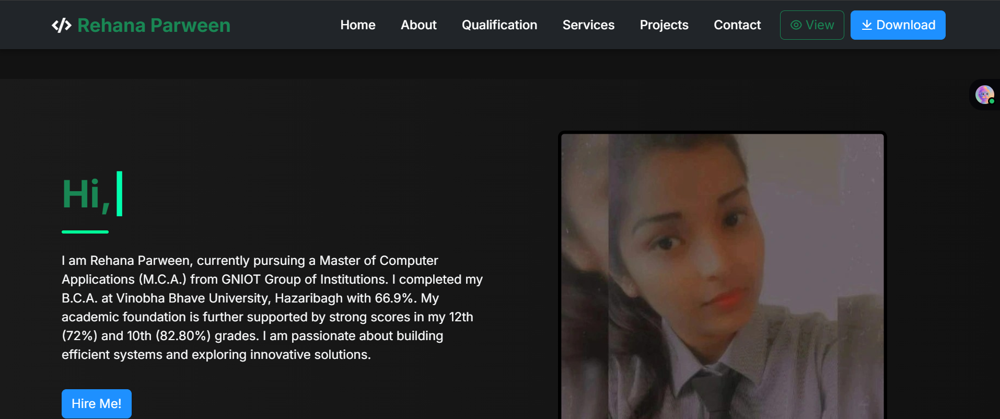

# 🌐 Rehana Parween - Developer Portfolio
&nbsp;&nbsp;

# 🌟 Rehana Parween – Developer Portfolio

(https://rehanacode.netlify.app)
(https://github.com/Rehana-04)

---

## 🌐 Live Preview

🔗 [Visit Live Portfolio on Netlify](https://rehanacode.netlify.app)

---

## 🎯 About Me

Hi! I’m **Rehana Parween**, an aspiring **Data Analyst & Developer** passionate about building efficient systems, exploring innovative solutions, and visualizing insights from data.  

- 🎓 MCA Student at GNIOT Group of Institutions  
- 💻 Skills: Python, SQL, R, Data Visualization, Web Development  
- 📈 Focus: Data Analysis, Automation, and Dashboarding  

[📫 Hire Me](mailto:rehanaparween0012@gmail.com)

---

## 🛠️ Technologies & Tools

| Category | Tools |
|----------|------|
| Programming Languages | Python, R, SQL |
| Data Analysis & Visualization | Pandas, NumPy, Matplotlib, Seaborn, Tableau, Power BI |
| Databases | MySQL, PostgreSQL, MongoDB |
| Web Development | HTML5, CSS3, Bootstrap 5, JavaScript |
| Others | Excel, Google Sheets, Jupyter Notebook, Google Data Studio |

---

## 💼 Services

  
  
  
  
  

---

*Click on screenshots to view live sections.*

---

## 📂 Project Structure

rehanaPortfolio/
├── index.html
├── css/
│ └── style.css
├── js/
│ └── script.js
├── img/
│ └── images & icons
├── pdf/
│ └── RehanaResume.pdf

---

## 🚀 Projects

| Project | Description | Link |
|---------|-------------|------|
| Smart Air Quality System | IoT-based system monitoring air quality with a web dashboard | [View](#) |
| Portfolio Website | Personal portfolio built with HTML, CSS, Bootstrap & JS | [View](https://rehanacode.netlify.app) |
| Expense Tracker | Web app for personal finance management using HTML, CSS & JS | [View](#) |

🔗 [See More Projects on GitHub](https://github.com/Rehana-04)

---

## 🎓 Education & Qualifications

| Degree | Institution | Year | Score |
|--------|------------|------|-------|
| MCA | GNIOT Group of Institutions | 2024-Present | Ongoing |
| BCA | Vinobha Bhave University | 2021-2024 | 66.9% |
| XII | Board of Intermediate Education | 2021 | 72% |
| X | Board of Secondary Education | 2019 | 82.8% |

---

## 📫 Contact Me

  
  
  

---

## 📄 License

This project is **open-source** and free to use. Attribution is appreciated but not required.

---

  Made with ❤️ by <b>Rehana Parween</b>

